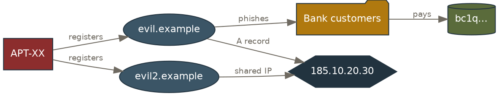

# Graphviz recipes — entity / infrastructure link analysis

Node shapes per entity type (house convention):

| Entity | shape | fill |
|---|---|---|
| Threat actor | `box` | brick `#8c2d2d` |
| Domain | `ellipse` | steel `#3b5566` |
| IP address | `hexagon` | slate `#22333f` |
| Victim / target | `folder` | ochre `#b0790f` |
| Wallet | `cylinder` | olive `#5a6b3b` |
| Registrar / ASN | `note` | sand `#c9b892` |

## Template (`graph.dot`)

Render:
```bash
python scripts/render_graphviz.py graph.dot outputs/infra_map
```

Tips: use `rank=same { ip1 ip2 }` to align infra rows; label edges with the pivot
that proves them (`favicon hash`, `GA4 G-…`, `shared IP`) so the graph is
self-documenting. Keep to one accent (brick) for the focal actor; everything else muted.
