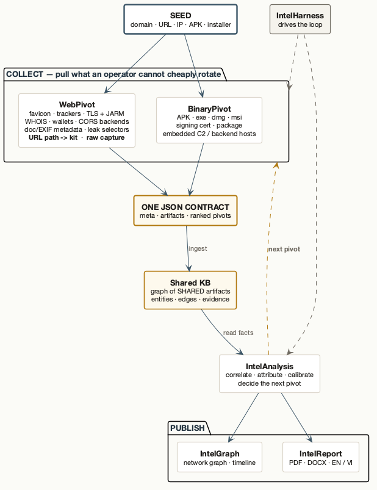
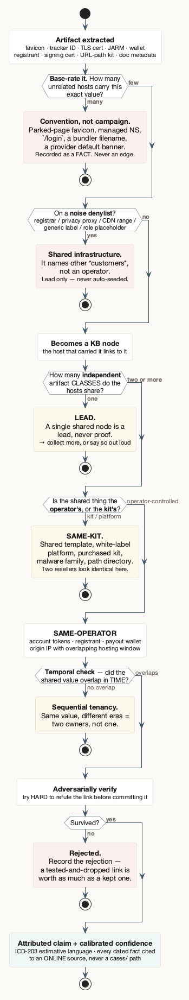
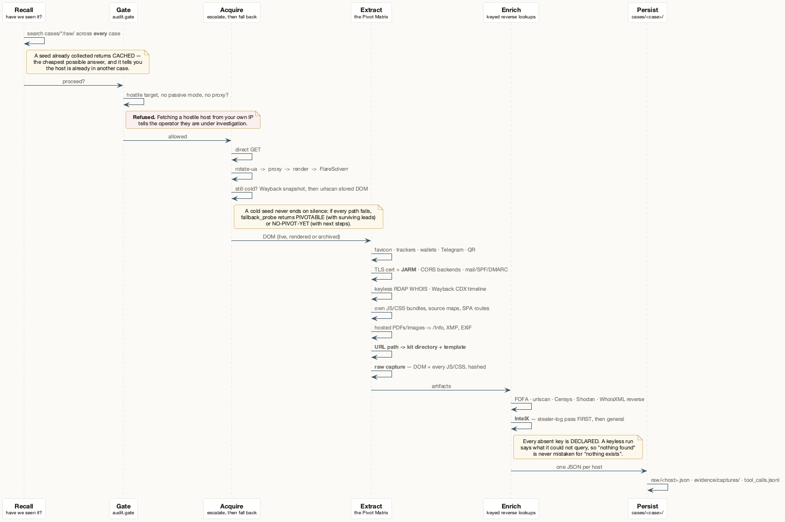
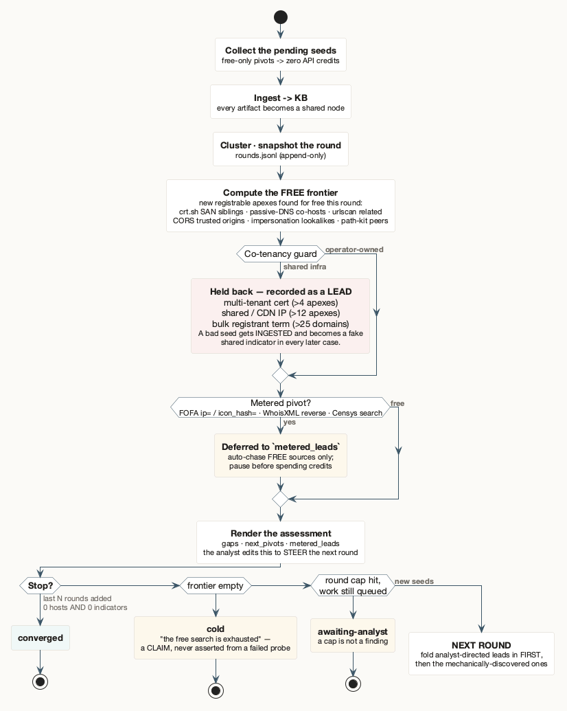
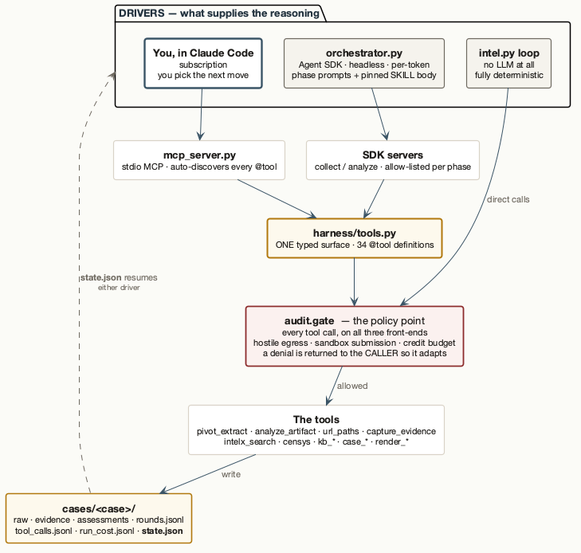

<div align="center">

# Ordo

**An OSINT investigation kit for Claude Code.**
Trace a scam operation from *one* website — or the app it pushes — to the **operator behind the whole cluster**.

`WebPivot` · `BinaryPivot` · `IntelAnalysis` · `IntelGraph` · `IntelReport` · `IntelHarness`

<sub>Claude Code skills · Python 3.8+ · shared, portable, case-data-free</sub>
<br><sub>repo: <code>intelligence_assist</code></sub>

</div>

---

## The one-minute mental model

You rarely care about a single domain — you care about **who runs the network**, and about the identifiers that expose them. This kit turns a seed into that answer:

1. **Collect** — pull the identifiers a page (or a downloaded app) can't cheaply rotate.
2. **Ingest** — every identifier becomes a **node** in a shared knowledge base; the host that carried it links to it.
3. **Correlate** — hosts that share nodes are a **cluster**; the analyst layer attributes it and calibrates confidence.
4. **Deliver** — a network graph and a report-ready PDF/DOCX.

The trick that makes it fit together: **a website and the app it pushes emit the *same* JSON shape**, so one pipeline clusters them automatically.

<div align="center">

</div>

> [!IMPORTANT]
> **This is a shared tool — keep it clean.** The committed skills contain **only synthetic placeholders** (`site-a.example`, `com.example.app`, `CASE-0001`). Your real investigation data lives in `cases/` and `knowledge/`, which are **git-ignored and must never be committed.** See [OPSEC](#opsec--this-is-a-shared-tool).

---

## What's in the box

Six skills — two that **collect**, one that **thinks**, two that **publish**, one that **drives** — over one shared knowledge base.

| Skill | Role | What it does |
|---|---|---|
| **WebPivot** | 🔎 Web collector | Pulls pivot artifacts from a page — favicon hash, tracking/analytics IDs, keyless-RDAP WHOIS, wallets, TLS cert **+ JARM TLS-stack fingerprint**, CORS-trusted backend origins, SaaS/no-code operator tokens, hosted-document metadata, Telegram, footer address. Also reads the **URL path as a campaign identifier**, stores a **hash-manifested raw capture**, searches leak/stealer-log corpora, and hunts typosquat lookalikes. |
| **BinaryPivot** | 📦 File collector | Static IOC extraction from the binary a scam site serves (APK / `.exe` / `.dmg` / `.msi`): file hash, APK signing cert, package, embedded backend/C2 hosts, Firebase tenant, wallets. Emits **WebPivot-shaped JSON** so the app clusters with the web infra. |
| **IntelAnalysis** | 🧠 Analyst | Correlates, attributes (same-kit / same-operator / same-actor), calibrates confidence, decides the next pivot. Reasons over the KB — it does **not** collect. |
| **IntelGraph** | 📈 Visualizer | Charts, lifecycle timelines, and clustered interactive network graphs from the case data. |
| **IntelReport** | 📄 Publisher | Renders a finished assessment into a polished PDF + editable DOCX — editorial house style, **English or Vietnamese**. |
| **IntelHarness** | 🎛️ Case runner | Drives Collect → Correlate → Assess over one or many seeds, conversationally, from your Claude subscription. |

### One contract makes it chain

WebPivot **and** BinaryPivot emit the same pivot-JSON: a `meta` block, an `artifacts` block, and a ranked `pivots` array of copy-paste queries. Because a downloaded APK's backend host lands in the *same field* a website's backend host does, **one ingester, one correlation pass and one cluster report cover a site and its app together.**

---

## The chain of logic

This is the part that matters. Collection is mechanical; what makes the output trustworthy is the sequence of guards between *"I found a shared value"* and *"these are the same operator"*. **Every guard below exists because skipping it produces a confident, wrong answer.**

<div align="center">

</div>

Read it as six questions asked in order:

| # | Question | Why it kills a false cluster |
|---|---|---|
| 1 | **What's the base rate?** | A parked-page favicon, a managed nameserver, `/login`, a bundler filename or a provider's default banner appear on millions of unrelated hosts. Count the population *before* calling a value a fingerprint. |
| 2 | **Is it on a noise denylist?** | Registrar, privacy-proxy, CDN range, generic label — these name other **customers**, not an operator. Recorded as a lead; never auto-seeded, because a bad seed gets *ingested* and becomes a fake shared indicator in every later case. |
| 3 | **How many independent artifact *classes*?** | One shared node is a **lead**, never proof. Two domains sharing a favicon *and* a GA4 ID *and* a wallet is a different claim from three domains sharing a favicon. |
| 4 | **Is the shared thing the operator's, or the kit's?** | A shared template, white-label platform, malware family or path directory is **same-kit** — two resellers of one kit look identical here. Same-operator needs something *the operator controls*: an account token, a registrant, a payout wallet. |
| 5 | **Did it overlap in time?** | Co-tenancy is an *overlap* claim. The same IP in two different eras is two owners, not one. |
| 6 | **Does it survive an attack?** | Every link is adversarially refuted before it's committed. A link you never attacked isn't defensible — and a tested-and-rejected link is worth recording as much as a kept one. |

Only then does a claim get written, in ICD-203 estimative language, with every dated fact cited to an **online** source rather than a local `cases/` path.

> [!NOTE]
> The three verdicts are deliberately different claims. **same-kit** = same tooling. **same-operator** = one hand on the controls. **same-actor** = same real-world entity. Collapsing them is the single most common way an OSINT report overstates itself.

---

## What actually happens to one seed

<div align="center">

</div>

- **Recall first.** Before anything is fetched, the host is searched across `cases/*/raw/` in **every** case. A hit is the cheapest possible answer *and* tells you it's already in another investigation.
- **The gate is above the tools.** One policy point refuses a live fetch of a hostile target from your own IP, an unapproved sandbox submission, and a metered call past the run's credit budget. A denial is returned to the caller with a reason, so it adapts instead of dying.
- **Acquire escalates, then falls back.** Direct GET → UA rotation → proxy egress → real browser render → FlareSolverr; and if all of that fails, Wayback and urlscan's stored DOM. **A cold seed never ends on silence** — `fallback_probe` returns `PIVOTABLE` (with surviving leads) or `NO-PIVOT-YET` (with next steps).
- **Extract runs the whole Pivot Matrix, on every seed** — not opportunistically. Attribution is only as strong as your *strongest* shared artifact, so anchoring a report on WHOIS while a JARM or account-token link sits unread in the same DOM is the classic weakness.
- **Enrich declares what it couldn't do.** Every absent API key is named along with the evidence class its absence removes, so *"nothing found"* is never mistaken for *"nothing exists"*.

---

## Quickstart

<details>
<summary><b>1. Install — prerequisites & registering the skills</b> (click to expand)</summary>

**Prerequisites:** [Claude Code](https://claude.com/claude-code) and Python 3.8+. WebPivot's core needs nothing beyond the stdlib.

Claude Code discovers skills from `~/.claude/skills/`. Symlink each folder across (edit once, live everywhere):

```bash
# from the repo root
for s in WebPivot BinaryPivot IntelAnalysis IntelGraph IntelReport IntelHarness; do
  ln -s "$PWD/$s" ~/.claude/skills/$s
done
```

Optional accelerators:

```bash
# WebPivot — faster fetch + rendered post-JS DOM (hosted-builder funnels, --render)
pip install requests playwright && playwright install chromium

# BinaryPivot — zero required deps. Optional: keytool (any JDK) → APK signing-cert SHA-256,
# openssl → cert fallback, file/strings → typing + faster sweep

# IntelGraph — charts + entity graphs (render_network.py is zero-dependency; JS is vendored)
pip install matplotlib

# IntelReport — pandoc + xelatex for PDF; pandoc alone for DOCX
# Diagrams in this README — plantuml + graphviz
```

</details>

### 2. Run a case — three ways, same result

**(a) One command** — deterministic, no LLM, fully repeatable:

```bash
CASE=cases/mycase; mkdir -p "$CASE"
printf 'suspicious-site.example\nother-domain.example\n' > "$CASE/domains.txt"

python3 tools/intel.py open mycase "$CASE/domains.txt"      # extract → ingest → cluster
python3 tools/intel.py status mycase                        # audit what persisted

# or as a resumable convergence loop — collect → assess → chase the free frontier → repeat:
python3 tools/intel.py loop mycase "$CASE/domains.txt"      # free-only pivots → zero credits
python3 tools/intel.py loop mycase                          # resume exactly where it paused
```

**(b) Conversationally, in Claude Code** — best for judgment and letting the agent pick the next pivot:

> *"Work case mycase from these seeds: site-a.example, site-b.example — collect, correlate, and tell me who the operator is."*

Follow-ups that work: *"converge the case"*, *"cluster these 40 domains"*, *"render the network graph"*, *"make it a PDF in Vietnamese"*.

**(c) Unattended / batch** — headless Agent-SDK driver (needs `ANTHROPIC_API_KEY`, pay-per-token):

```bash
source harness/.venv/bin/activate && export ANTHROPIC_API_KEY=...
python3 harness/orchestrator.py CASE-0001 --parallel --continue --depth 4 seed1.example seed2.example
```

> [!TIP]
> **The reasoning backend is swappable.** `HARNESS_BACKEND=openai|deepseek|kimi|local` runs the SDK driver against any OpenAI-compatible `/chat/completions` endpoint — the orchestrator is untouched.

---

## The case loop — convergence is the stop condition

A case is *done* when a round adds no new shared artifact — not when a depth counter runs out. Hitting a cap is reported as `awaiting-analyst`, never as done.

<div align="center">

</div>

**What "the frontier" is.** Each round mines every `raw/*.json` for registrable apexes discovered **for free** that round — crt.sh SAN siblings, passive-DNS co-hosts, urlscan related domains, CORS trusted origins, impersonation lookalikes, path-kit peers — reduced to apexes, filtered through the shared noise policy, and deduped against every case.

**What is held back from seeding**, because a bad seed becomes a fake shared indicator everywhere:

| Guard | Threshold | Why it isn't an operator link |
|---|---|---|
| multi-tenant TLS cert | > 4 distinct apexes | cPanel AutoSSL / LE multi-domain — the co-names are other customers |
| shared / CDN IP | > 12 apexes on one IP | bulk hosting or a CDN edge |
| bulk registrant term | > 25 domains | a reseller or privacy-proxy term |

Metered pivots (FOFA `ip=`/`icon_hash=`, WhoisXML reverse, Censys search) are deferred to `metered_leads` for approval — **auto-chase free sources only; pause before spending credits.**

**The analyst is in the loop, literally.** Between rounds the loop re-reads `assessment.json` and folds domain-like tokens from your `next_pivots` and `gaps` into the frontier **ahead of** the mechanically-discovered ones. Editing the assessment is how you steer the next round.

`CONVERGED` = the last `--stale` rounds (default 2) each added **zero new hosts and zero new indicators**, read from `rounds.jsonl`, which `tools/kb/convergence.py` alone owns.

---

## Two front-ends, one tool surface

What differs between the drivers is only where the **reasoning** comes from. The tools, the gate and the case files are identical — which is why a case started in one can be finished in the other.

<div align="center">

</div>

| | **Interactive** (Claude Code) | **Headless** (`orchestrator.py`) | **Deterministic** (`intel.py loop`) |
|---|---|---|---|
| Reasoning | Claude, in your session | Claude, per phase | none |
| Steered by | the `SKILL.md` bodies | `harness/prompts/*.md` + pinned SKILL body | code |
| Tool surface | MCP server `intel` — all 34 tools | the same objects, allow-listed per phase | direct calls |
| Cost | subscription | per-token | free |
| Stop condition | you | convergence → `state.json` | convergence → `state.json` |

**One registration point.** A new CLI tool becomes an `@tool(...)` in `harness/tools.py` — that single edit exposes it to the SDK orchestrator, the stdio MCP server (auto-discovered) **and** interactive Claude Code. `tests/test_tool_registry.py` asserts the two front-ends can never silently diverge.

Headless splits reasoning into phases, each with its own model and allow-list. Judgment runs in a **fresh session** and re-reads facts from the KB through tools rather than resuming the large collect transcript — that one decision is the main cost control. Assess is **schema-forced**, so "done" means a validated `Assessment` object exists, not that the model said it was finished.

### What the run will refuse to do

| Refusal | Why |
|---|---|
| Live-fetch a hostile target from your IP | it tells the operator they're under investigation |
| Submit a sample or URL to a sandbox without an explicit `yes` | outbound, attributable, irreversible — and public on a free plan |
| Auto-run a metered pivot inside the convergence loop | credits are per-account and don't roll over |
| Seed the frontier from a multi-tenant cert, shared IP, or bulk registrant | those name other *customers* |
| Report "nothing found" on a keyless run without saying so | a missing reverse index is not evidence of absence |
| Overwrite an `assessment.md` it doesn't recognise as its own | that file is the analyst's |

---

## Under the hood

<details>
<summary><b>Why each artifact is a pivot</b></summary>

Every artifact is chosen because it **survives re-skinning** — an operator changes a domain and logo in minutes, but the identifiers underneath are expensive to rotate:

- **Favicon hash** — same icon across unrelated domains = shared kit/operator. Emitted per engine with the right algorithm (Shodan/FOFA = mmh3, Censys = md5, Netlas = sha256).
- **Analytics / operator tokens** — GA4 `G-`, `GTM-`, AdSense `pub-`, plus SaaS/no-code account IDs. An account ID ties every property the operator ever wired to it, even scrubbed ones.
- **Live TLS certificate** — SANs on a *different* registrable domain are a cross-brand operator link.
- **JARM TLS-stack fingerprint** — an *active* hash of the server's TLS stack, **not** the leaf cert. It survives a full domain **and** certificate rotation. Suppressed under `--proxy` (raw-socket probe).
- **CORS policy** — an active probe reads `Access-Control-Allow-Origin`, naming **a backend the app trusts that never appears in the page HTML**.
- **Document & image metadata** — the files the site *hosts*. Nobody re-exports the PDF when the brand changes, so `/Info`, XMP and EXIF outlive every re-skin; an **XMP DocumentID is minted per source document**, so the same id on two domains means literally the same file.
- **URL path → kit directory** — when hostnames are disposable and the *path* selects the branded template, the kit directory is the one string that survives host rotation. Base-rate controlled: `/login` and `/assets` cluster nothing.
- **Redirect chains, wallets (incl. QR-hidden), Telegram, WHOIS registrant** — independent threads back to the operator.

</details>

<details>
<summary><b>Raw evidence — the bytes, not just the summary</b></summary>

Everything above is *derived*: a hash, a fingerprint, an extracted value — an assertion about a page that will be gone in days, after which nobody can re-check it. So a run with `--case` also stores the page itself:

```
cases/<case>/evidence/captures/<host>/<kit>/<UTC>/
    dom.html   manifest.json   assets/   third_party/
```

Every file carries its own sha256; the bundle carries a `capture_sha256` over the sorted digests — **cite that, not a directory path**, because any later edit changes it. Captures are timestamped and never overwritten, so the **diff between two captures dates a re-skin**. Budgets are explicit: anything dropped is listed in `skipped_for_budget` and the manifest is stamped `INCOMPLETE`.

</details>

<details>
<summary><b>Live vs passive, and OPSEC-aware collection</b></summary>

WebPivot fetches live by default but **always** also pulls the Wayback CDX timeline — a parked page today may have been a live scam funnel last year. Against hostile or Cloudflare-challenged targets it escalates, and failing that falls back to passive sources so a cold seed never ends on silence. Raw-socket probes are suppressed when a proxy is set so they can't leak your real IP.

</details>

<details>
<summary><b>Cost accounting — two separate meters</b></summary>

- **Anthropic model cost** (the agent's reasoning) — captured per run to `cases/<case>/run_cost.jsonl`. In interactive Claude Code, run `/cost`.
- **Third-party API credits** (FOFA / WhoisXML / urlscan / IPinfo / Shodan / Censys / IntelX / ANY.RUN) — **not** in the model cost. Logged to `MEMORY/api_usage.jsonl`. When you report what a case cost, state the split.

Censys is the tightest quota — 100 credits a **month**, per account, no rollover, and the emitted UI link costs the same as an API search.

</details>

### Where things live

```
cases/<case>/
  domains.txt          seed list                    raw/<host>.json      one pivot-JSON per host/binary
  shared.txt           cluster seeds (fast path)    dom/<host>.html      collected DOM
  SUMMARY.md           current assessment           assessments/<UTC>_*  immutable snapshots (audit)
  state.json           resumable-loop cursor        assessment.json      gaps / next_pivots / metered_leads
  run_cost.jsonl       Anthropic model cost         tool_calls.jsonl     one line per gated tool call
  evidence/manifest.jsonl · master_pivots.csv · captures/<host>/<kit>/<UTC>/
knowledge/             the attributed cross-case KB (entities, edges, cached payloads)
MEMORY/api_usage.jsonl third-party API credit ledger
```

Everything under `cases/` and `knowledge/` is git-ignored.

<details>
<summary><b><code>cases/</code> vs <code>knowledge/</code> — different axes, one-way flow</b></summary>

`cases/<case>/` is **one investigation's** working directory; `knowledge/` is the **single cross-case store** every case feeds into. Neither is a superset — `knowledge/` has no DOM, figures or per-run cost, and a case folder has no cross-case entity merge, which is what makes `which_cases` and prior-overlap alerts work. **All case deliverables live in `cases/<case>/`.**

Two naming traps:

- **`evidence/` means two things.** `knowledge/evidence/<source>/<target>/<day>.json` is raw cached third-party payloads, deduped across cases. `cases/<case>/evidence/` is an *index* of what one case collected (plus its raw captures).
- **`assessment.md` is the analyst's; `loop_assessment.md` is the machine's.** A writer may overwrite only output it recognises as its own; anything else it leaves alone. So when writing by hand, don't open your assessment with a renderer's signature (`# Cluster Intelligence Assessment — `, `# Intelligence Assessment — `, or a bare `# Assessment` followed by `**BLUF —**`).

</details>

---

## Diagrams

Every diagram in this README is generated from a **PlantUML source** in [`docs/diagrams/`](docs/diagrams) — the `.puml` is the editable original, the `.svg`/`.png` beside it is build output. Same philosophy as IntelGraph's editable Mermaid: a figure you can't edit is a figure that rots.

```bash
brew install plantuml graphviz     # or: apt install plantuml graphviz
./docs/diagrams/render.sh          # re-renders every .puml to .svg + .png
```

| Source | Shows |
|---|---|
| `01-skill-chain.puml` | which skill does what, and the one contract that chains them |
| `02-evidence-logic.puml` | **the chain of logic** — artifact → guards → attributed claim |
| `03-case-loop.puml` | the convergence loop and its four exit states |
| `04-front-ends.puml` | two drivers, one tool surface, one gate |
| `05-collect-one-seed.puml` | the inside of a single collection |

Styling lives in `_theme.puml` — the palette is shared with IntelGraph and IntelReport, so a README diagram, a case graph and a report figure look like one system.

---

## Roadmap — hooking into working-base *(planned)*

Today Ordo is **self-contained**: seeds in, assessments out, KB in a local `knowledge/` folder. The next step connects it to **working-base** — 0xdefh's detection platform (certstream / crt.sh / FOFA collectors feeding a normalized sighting store and a rule engine) — so the two form a closed loop.

The guiding idea: **the skills are the commodity; the KB is the moat.** The skills here are portable and case-data-free by design — anyone can copy them. The *accumulated investigation experience* (operator clusters, watchlist hashes, the attribution graph) can't be. So that experience lives in working-base as the **appreciating asset**, and this agent is the **replaceable brain** bolted onto it.

| Rail | Direction | Status |
|---|---|---|
| **① Lead-out** | working-base detections → seed queue this agent drains | 🟡 planned |
| **② Write-back** | findings + learned attribution → back into working-base | 🟢 endpoint exists (`webpivot_ingest`) |

Both rails are **front-end agnostic** — built once, they work whether the agent runs in Claude Code or headless. Nothing below the roadmap depends on working-base; the integration is additive.

---

## OPSEC — this is a shared tool

> [!WARNING]
> **Never put real investigation data into the committed skills, tools, or docs** — no case names, target domains, operator/victim names, IPs, wallets, emails, API keys, tracker tokens, or signing-cert hashes, *including as a "worked example."* Partial redaction leaks structure; invent examples instead of anonymizing real ones.

**Use only generic placeholders:** `site-a.example`, `target.example`, `com.example.app`, `G-XXXXXXXXXX`, `CASE-0001`. The `.example` TLD is reserved and never resolves.

Your private data stays git-ignored (`cases/`, `knowledge/`, `knowledge_scratch/`, `MEMORY/`, `.env`) — never `git add -f` them. Before you push:

```bash
git ls-files cases/ knowledge/ knowledge_scratch/     # must print NOTHING
git diff --cached                                     # eyeball staged docs for real IOCs
git grep -nE '\b([0-9]{1,3}\.){3}[0-9]{1,3}\b|\b(bc1|0x[0-9a-f]{40})\b' -- WebPivot BinaryPivot IntelGraph IntelAnalysis IntelHarness
```

> [!CAUTION]
> **Authorized investigations only.** See `WebPivot/EthicalFramework.md`. Fetching a hostile site touches it directly — prefer passive sources or non-attributable egress for adversarial targets. Pull binaries only from infra you're authorized to investigate; BinaryPivot is **static** extraction and never runs the sample.

---

## Adding a new tool or skill — register it once

Per the repo `CLAUDE.md` (RULE 2): wrap a new CLI tool as an `@tool(...)` in `harness/tools.py`, and add it to its SDK server **and** that server's allow-list. That exposes it to the SDK orchestrator, the stdio `mcp_server.py` (auto-discovered), **and** interactive Claude Code. A new *mode* of an existing tool needs no new `@tool` — just extend that tool's description.

```bash
python3 tests/test_tool_registry.py                # the two front-ends must agree
WebPivot/.venv/bin/python3 harness/mcp_server.py   # send a tools/list JSON-RPC
python3 tools/eval/run_eval.py                     # the full regression gate
```

Reference **data** — denylists, thresholds, lookup tables — belongs in `<module>/references/*.json`, never in Python (RULE 3), so an analyst can tune it without a redeploy.

---

## Go deeper

| Doc | What it covers |
|---|---|
| **`PIPELINE.md`** | Step-by-step runbook for collect → correlate → visualize, a flags cheat-sheet, a worked example. |
| **`harness/README.md`** | The Agent-SDK driver in depth — model cascade, cost levers, convergence, parallel cluster judgment, the egress guardrail. |
| **`WebPivot/SKILL.md`** + `references/` | The full pivot-artifact catalogue (TLS, JARM, CORS, URL paths, captures, IntelX) and per-engine query syntax. |
| **`WebPivot/references/PivotMatrix.md`** | The "run every dimension on every seed" discipline — the artifact strength hierarchy that ranks attribution. |
| **`IntelAnalysis/SKILL.md`** + `Workflows/` | The judgment layer — correlation, temporal analysis, victim profiling, path-routed estates, leak-corpus tradecraft. |
| **`IntelHarness/SKILL.md`** | The in-Claude case-runner playbook — phases, when to reject, when to stop. |
