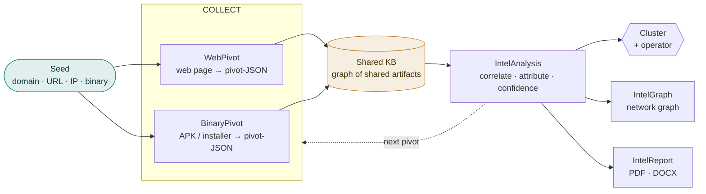
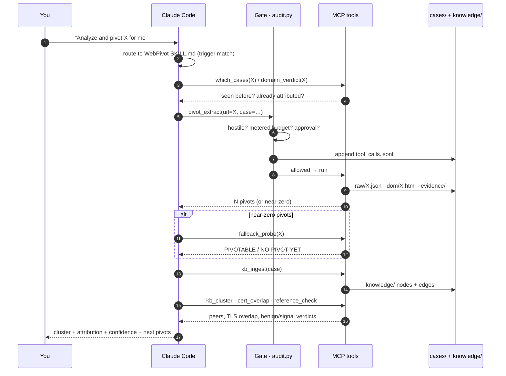
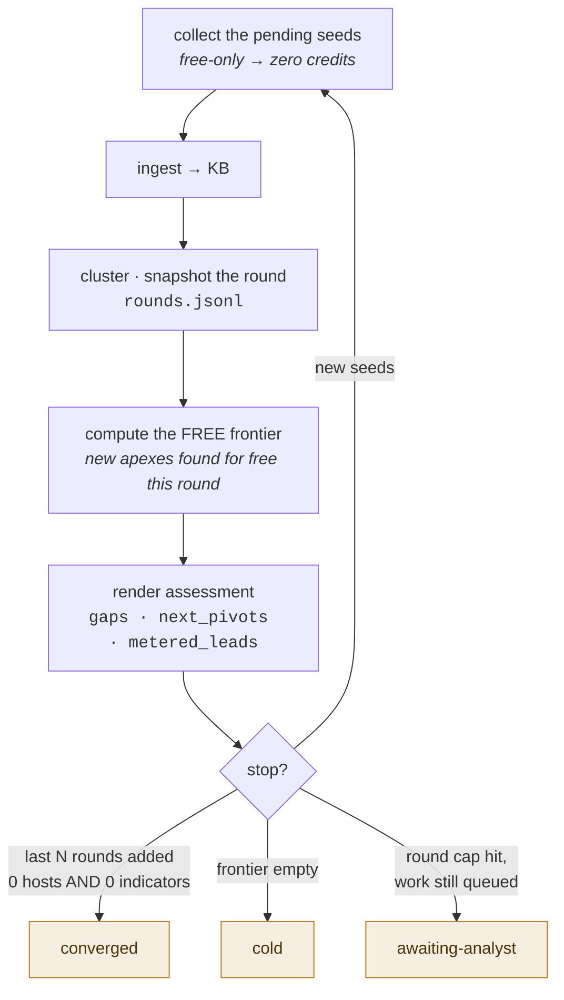
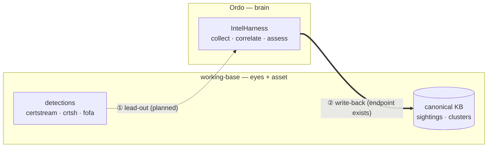

<div align="center">

# Ordo

**An OSINT investigation kit for Claude Code.**
Trace a scam operation from *one* website — or the app it pushes — to the **operator behind the whole cluster**.

`WebPivot` · `BinaryPivot` · `IntelAnalysis` · `IntelGraph` · `IntelReport` · `IntelHarness`

<sub>Claude Code skills · Python 3.8+ · shared, portable, case-data-free</sub>
<br><sub>repo: <code>intelligence_assist</code></sub>

</div>

---

## The one-minute mental model

You rarely care about a single domain — you care about **who runs the network** and the identifiers that expose them. This kit turns a seed into that answer:

1. **Collect** — pull the identifiers a page (or a downloaded app) can't easily rotate: favicon hash, analytics IDs, TLS cert, backend hosts, wallets, WHOIS, signing certs.
2. **Ingest** — every identifier becomes a **node** in a shared knowledge base; the host it came from links to it.
3. **Correlate** — domains that share nodes are the **same cluster**; the analyst layer attributes and scores confidence.
4. **Deliver** — a network graph and a report-ready PDF/DOCX.

The trick that makes it all fit together: **a website and the app it pushes emit the *same* JSON shape**, so one pipeline clusters them together automatically.



> [!IMPORTANT]
> **This is a shared tool — keep it clean.** The committed skills contain **only synthetic placeholders** (`site-a.example`, `com.example.app`, `CASE-0001`). Your real investigation data lives in `cases/` and `knowledge/`, which are **git-ignored and must never be committed.** See [OPSEC](#opsec--this-is-a-shared-tool).

---

## What's in the box

Six skills — three that **collect**, one that **thinks**, two that **publish** — over one shared knowledge base.

| Skill | Role | What it does |
|---|---|---|
| **WebPivot** | 🔎 Web collector | Pulls pivot artifacts from a page — favicon hash, tracking/analytics IDs, keyless-RDAP WHOIS, crypto wallets, TLS cert **+ JARM TLS-stack fingerprint**, CORS-trusted backend origins, SaaS/no-code operator tokens, Telegram, footer address — and emits ready-to-run pivot queries (Shodan, PublicWWW, crt.sh, urlscan…). Runs the full **Pivot Matrix** on every seed, flags app-download funnels, and hunts typosquat/lookalike domains. |
| **BinaryPivot** | 📦 File collector | Static IOC extraction from the binary a scam site serves (APK / `.exe` / `.dmg` / `.msi`): file hash, APK signing-cert, package, embedded backend/C2 hosts, Firebase tenant, wallets. Emits **WebPivot-shaped JSON** so the app clusters with the web infra. |
| **IntelAnalysis** | 🧠 Analyst | Correlates, attributes (same-kit / same-operator / same-actor), calibrates confidence, decides the next pivot. Reasons over the KB — it does **not** collect. |
| **IntelGraph** | 📈 Visualizer | Charts, timelines, and clustered interactive network graphs from the case data. |
| **IntelReport** | 📄 Publisher | Renders a finished assessment into a polished PDF + editable DOCX (editorial house style, Vietnamese-safe typography). |
| **IntelHarness** | 🎛️ Case runner | Drives the whole Collect → Correlate → Assess pipeline over one or many seeds, conversationally, from your Claude subscription. |

### One contract makes it chain

WebPivot **and** BinaryPivot emit the same pivot-JSON: a `meta` block, an `artifacts` block (every identifier found), and a ranked `pivots` array (copy-paste queries). Because a downloaded APK's backend host lands in the *same* field a website's backend host does, **one ingester, one correlation pass, and one cluster report cover a site and its app together.** A shared favicon hash, GA4 ID, wallet, or signing cert becomes the **same KB node** no matter which collector found it — so the app and the site converge on their own.

> [!NOTE]
> **The KB is a graph of *shared* artifacts.** Two domains pointing at the same `favicon:123456789` are a lead; two sharing that **and** `ga:G-XXXXXXXXXX` are a cluster. A single shared node is a lead, never proof — corroboration is a first-class rule.

---

## Quickstart

### 1. Install

<details>
<summary><b>Prerequisites & registering the skills</b> (click to expand)</summary>

**Prerequisites:** [Claude Code](https://claude.com/claude-code) (`claude --version`) and Python 3.8+. WebPivot's core needs nothing beyond the Python stdlib.

Claude Code discovers skills from `~/.claude/skills/`. Symlink each folder across (edit once, live everywhere):

```bash
# from the repo root
for s in WebPivot BinaryPivot IntelAnalysis IntelGraph IntelReport IntelHarness; do
  ln -s "$PWD/$s" ~/.claude/skills/$s
done
```

Restart Claude Code, then verify: `/WebPivot`, `/BinaryPivot`, `/IntelAnalysis`, `/IntelGraph`, `/IntelReport`, `/IntelHarness`. Confirm the shared tool surface with `/mcp` (server `intel`).

</details>

<details>
<summary><b>Optional dependencies</b> — install only what you use</summary>

```bash
# WebPivot — faster fetch + rendered post-JS DOM (needed for hosted-builder funnels / --render)
pip install requests playwright && playwright install chromium

# BinaryPivot — zero required deps (stdlib). Optional accelerators if present:
#   keytool (any JDK) → APK signing-cert SHA-256 (strongest same-operator pivot)
#   openssl → cert fallback · file/strings → typing + faster sweep · requests → nicer download

# IntelGraph — charts + entity graphs
pip install matplotlib graphviz          # graphviz also needs `dot`: brew install graphviz
npm i -g @mermaid-js/mermaid-cli         # only for Mermaid flows
# render_network.py (interactive graphs) is ZERO-dependency — JS libs are vendored.

# IntelReport — pandoc + a LaTeX engine (xelatex) for PDF; pandoc alone for DOCX.
```

</details>

> [!TIP]
> **API keys are optional — but keyless is a *smaller search*, and the tools say so.** Without keys everything still runs (extraction + query generation + **keyless-RDAP WHOIS** + passive Wayback/urlscan). WHOIS runs on *every* domain with no key — keyless RDAP (rdap.org bootstrap) with a port-43 fallback for TLDs like `.vn`; `WHOISXML_API_KEY` only *enriches* it with registrant history. Keys unlock live pivoting. Read from the environment first, then a `chmod 600 ./.env` at the repo root: `URLSCAN_API_KEY`, `FOFA_KEY`, `FOFA_EMAIL`, `WHOISXML_API_KEY`, `CENSYS_PAT`, `PDNS_*`. Full keychain setup in `WebPivot/INSTALL.md`.
>
> WebPivot **extracts** every artifact keylessly; what a key buys is the ability to **reverse** one. So a keyless run's short pivot list can mean "no siblings exist" *or* "the index that would have found them was never queried" — and those are different findings. Run `python3 WebPivot/tools/wp_capabilities.py` (or the `capability_check` MCP tool) to see exactly which evidence classes are unavailable; every run also prints it as a banner and records it as `meta.capability` in the result JSON. Report it before any "nothing found".
>
> ⚠️ **Censys is the tightest quota:** 100 credits a **month** on the free plan, no rollover, **per account** — and running the emitted CenQL in the web UI costs the same 5 credits as an API search. Prefer the free keyless CenQL builder and the 1-credit `cert` lookup; check `python3 WebPivot/tools/wp_censys.py budget` before a batch. The spend guard caps it per month and per run.

### 2. Run a case — three ways, same result

Pick by how you want to drive it. All three use the same tools and the same case files.

**(a) One command** — deterministic, no LLM, fully repeatable:

```bash
CASE=cases/mycase; mkdir -p "$CASE"
printf 'suspicious-site.example\nother-domain.example\n' > "$CASE/domains.txt"

python3 tools/intel.py open mycase "$CASE/domains.txt"                     # extract → ingest → cluster
python3 tools/intel.py open mycase "$CASE/domains.txt" --render --operator "name"  # + network graph
python3 tools/intel.py status mycase                                      # audit what persisted

# or drive it as a resumable convergence loop — collect → assess → chase the free frontier → repeat:
python3 tools/intel.py loop mycase "$CASE/domains.txt"                    # first run (free-only pivots → zero credits)
python3 tools/intel.py loop mycase                                        # resume exactly where it paused (state.json)
```

**(b) Conversationally, in Claude Code** — best for judgment and letting the agent choose the next pivot:

> *"Work case mycase from these seeds: site-a.example, site-b.example — collect, correlate, and tell me who the operator is."*

`IntelHarness` runs Collect → Correlate → Assess, archives evidence, never ends a cold seed on silence, and writes a **versioned, cited assessment**. Follow-ups that work: *"converge the case"*, *"cluster these 40 domains"*, *"render the network graph"*, *"make it a PDF"*.

**(c) Unattended / batch** — headless Agent-SDK driver (needs `ANTHROPIC_API_KEY`, pay-per-token):

```bash
source harness/.venv/bin/activate
export ANTHROPIC_API_KEY=...
python3 harness/orchestrator.py CASE-0001 --parallel --continue --depth 4 seed1.example seed2.example …
```

> [!NOTE]
> **Convergence is the stop condition, not a fixed depth.** A case is *done* when a collect/pivot round adds no new shared artifact to the cluster (`--continue` detects `CONVERGED` vs `EXPANDING`). `--parallel` scales to many domains by judging **clusters, not individual domains**.

> [!TIP]
> **The reasoning backend is swappable.** Set `HARNESS_BACKEND=openai|deepseek|kimi|local` and the SDK driver runs against any OpenAI-compatible `/chat/completions` endpoint (`harness/openai_backend.py` shim) — the orchestrator is untouched. Unset / `claude` uses the real Anthropic SDK. Useful for cost control or air-gapped runs.

---

## What actually happens when you say *"Analyze and pivot X for me"*

This section is the full trace: every tool that fires, every condition that is checked, and where
each artifact lands. Read it once and the rest of the repo stops being a black box.

**Two drivers, one set of tools.** Which one you're in decides what supplies the *reasoning*; the
tools, the gate, and the case files are identical either way.

| | **Interactive** (Claude Code) | **Headless** (`./intel open`) |
|---|---|---|
| Who chooses the next tool | Claude, in your session | Claude, per phase, inside `orchestrator.py` |
| What steers it | the **`SKILL.md` bodies** loaded by the Skill tool | the **phase prompts** in `harness/prompts/*.md`, with the SKILL body pinned as the system prompt |
| Tool surface | MCP server `intel` (31 tools) via `.mcp.json` | the same objects, in-process, allow-listed per phase |
| Tool gate | `audit.gate` in `mcp_server._call_tool` | a `PreToolUse` hook per phase |
| Stop condition | you | convergence → `state.json` hand-back |

The walkthrough below follows the **interactive** path, because that's the one the sentence above
lands in. Differences on the headless path are called out at the end.

### The trace



<details open>
<summary><b>Step 0 — Routing: which skill answers</b></summary>

Nothing runs yet. Claude Code matches your sentence against skill descriptions and loads
**`WebPivot/SKILL.md`** into context — its *Trigger Patterns* section lists exactly this phrasing
("analyze this site / page", "what can I pivot on here", "find related / sibling domains"). That
file is the prompt for everything that follows: its **Method (default flow)** is the 6 steps, and
its **Output contract** is what makes a run "done" (raw JSON → ingested → confirmed → reported).

If your sentence had named an APK or `.exe`, the same routing sends it to **`BinaryPivot`**
instead; a cluster-level question ("same operator?") pulls in **`IntelAnalysis`**; a whole case
("work case X from these seeds") pulls in **`IntelHarness`**.

</details>

<details open>
<summary><b>Step 1 — Recall before collect: have we seen X already?</b></summary>

The skill's first instruction is *don't re-do work*. Two read-only tools answer it:

| Tool | Question it answers |
|---|---|
| `which_cases(X)` | is this domain — or any artifact on it — already in a prior case? |
| `domain_verdict(X)` | is it already attributed to a known operator in `knowledge/operators.jsonl`? |

A hit here can end the request in seconds, and it's also how a **cross-case link** surfaces: an
indicator that appears in more than one case is a finding in itself.

</details>

<details open>
<summary><b>Step 2 — The gate: every tool call, before it runs</b></summary>

Between Claude and every tool sits **one** policy point (`harness/audit.py`). It runs on all three
front-ends, so no driver can be more permissive than another. Before `pivot_extract` executes:

| Condition checked | If it fails |
|---|---|
| **Hostile posture** (`--hostile` / `HARNESS_HOSTILE=1`) and the tool is outbound with no `passive=` / `proxy=` | **DENIED** — "re-call with `passive=true` or `proxy=<host>`" |
| Tool needs human approval (`anyrun_submit` — outbound, attributable, **irreversible**) and `HARNESS_ALLOW_SUBMIT` is unset | **DENIED** — ask the analyst, relaunch with the env var |
| Run has spent its metered budget (`max_metered_calls_per_run`, default 60) | **DENIED** — "re-call with `free_only=true`" |

A denial is returned **to the model as text**, so it adapts instead of the run dying. Allowed or
denied, the call is appended to **`cases/<case>/tool_calls.jsonl`** with its risk classes
(`outbound` / `metered` / `mutating`), redacted arguments and the reason. Read it back with the
`tool_calls` tool or `python3 harness/audit.py report <case> --denied`.

The lists and budgets are data — `harness/references/tool_policy.json` — so re-classifying a tool
needs no code change.

</details>

<details open>
<summary><b>Step 3 — <code>pivot_extract</code>: the two checks before a single packet leaves</b></summary>

The tool wraps `collect_one()` (`harness/tools.py`), which decides whether to touch the internet
at all:

1. **Already investigated?** `_find_cached_raw(host)` searches `cases/*/raw/` across **every** case.
   A hit is copied into the current case and returned as `ALREADY INVESTIGATED — reused cached
   pivot`, with **no** live fetch and **no** credits spent. `force=true` overrides.
2. **Egress policy** (defence in depth, below the gate): hostile + no `passive` + no `proxy`
   → refused here too.

Only then does it shell out to `WebPivot/tools/pivot_extract.py`, adding `--archive-missing
--master --case <case>` (evidence capture, on by default) and `--render --screenshot` when a
browser is available.

</details>

<details>
<summary><b>Step 4 — Inside <code>pivot_extract.py</code>: the acquire ladder and the extractors</b></summary>

**A. Acquire — escalate, then fall back. A cold seed never ends on silence.**

```
live fetch ──► HTTP < 400, body ≥ 200 bytes, no CF interstitial? ──► use it
     │  no
     ├─► Cloudflare challenge detected?
     │      --solve-cf → FlareSolverr, else --render a real browser
     ├─► still nothing → Wayback snapshot (web.archive.org/web/<ts>/)
     ├─► still nothing → urlscan's stored DOM from a prior scan
     └─► --archive-missing: submit to Save-Page-Now so a snapshot exists for next time
```
Only a genuine `/web/<timestamp>/` capture is analyzed — the `/save/` endpoint and archive.org
wrappers are rejected, because analyzing the wrapper invents archive.org pivots that aren't the
target's.

**B. Extract — the whole Pivot Matrix, on every seed.** Not opportunistically: attribution is only
as strong as your *strongest* shared artifact, so harvesting one dimension and stopping is the
classic report weakness. Favicon hash (per-engine algorithm), analytics/operator tokens, TLS leaf +
SANs, JARM (suppressed under `--proxy` — it's a raw-socket probe that would leak your real IP),
CORS trusted origins, redirect + affiliate chains, wallets incl. QR-decoded, Telegram, emails,
phones, Google Doc IDs, ETag, footer address, DOM/template fingerprints.

**C. The asset layer** — free, keyless, on by default. Fetches the page's *own* JS bundles and
re-runs every extractor over the source, because on a modern SPA the shell HTML is empty and the
operator's config exists only there: off-apex `api_endpoint` (the backend the front end was
compiled against — the strongest link in a white-label kit, since fronts rotate and backends
don't), `build_env:` tokens, `js_bundle_sha256`, the SPA route table (admin panels and funnel
routes as **leads** — discovered routes are never fetched), source maps → `dev_username` /
`dev_project`, and the published policy files (`ads.txt` → AdSense `pub-`, `security.txt`, AASA →
Apple team ID).

**D. Enrich — this is where keys decide how much of the internet you searched.**

| Always (keyless) | Only with a key — skipped entirely under `free_only=true` |
|---|---|
| live DNS, crt.sh + Shodan CTL, HackerTarget passive DNS, anonymous urlscan, **Wayback CDX timeline** | FOFA reverses, CIRCL passive DNS, urlscan-Pro structure similarity, Censys lookups |

`WHOIS` runs on every domain regardless — keyless RDAP with a port-43 fallback, backfilled by
WhoisXML when the key exists.

> **The keyless-disclosure rule.** A run without keys can't query the reverse indexes, so an empty
> cluster may be a **missing key, not an absent link**. `wp_capabilities` embeds this in
> `meta.capability` and prints it as a banner — and a keyless run must say so *before* any
> "nothing found".

**E. Persist** — `raw/<host>.json` (one file per host, so re-runs overwrite instead of duplicating
and the case stays reproducible), `dom/<host>.html`, `screenshots/`, plus the evidence manifest and
the master pivot ledger.

</details>

<details open>
<summary><b>Step 5 — The empty-result rule: never end a seed on silence</b></summary>

If `pivot_extract` comes back with zero/near-zero pivots — parked page, empty favicon, NXDOMAIN,
WHOIS + FOFA + urlscan all cold — the skill **requires** a `fallback_probe(X)` before moving on.
It works crt.sh, Wayback, archive.is, search dorks and the KB, and returns an explicit verdict:
**PIVOTABLE** (with the surviving leads) or **NO-PIVOT-YET** (with next steps). You always get a
verdict, never a shrug.

</details>

<details open>
<summary><b>Step 6 — Ingest: artifacts become a graph</b></summary>

`kb_ingest(case)` merges `cases/<case>/raw/*.json` into `knowledge/` — every artifact becomes a
**node**, the host that carried it becomes an **edge**. This is the step that makes correlation
possible; a run that isn't ingested is invisible to every later question.

Noise is filtered on the way in (`tools/kb/noise_filters.py` + `references/*.json`): managed-DNS
nameservers, parking favicons, registrar/privacy emails, platform-wide GA/GTM, default-template
hashes. Without it, shared Cloudflare nameservers alone would fuse thousands of unrelated domains
into one fake "operator".

</details>

<details open>
<summary><b>Step 7 — Correlate and attribute (the judgment layer)</b></summary>

Collection stops here; **`IntelAnalysis`** is a separate skill and does not start unless invoked —
by you, or by WebPivot's own step 6. It reads the KB through tools, never the raw transcript:

| Tool | Its job in the argument |
|---|---|
| `kb_cluster(X)` / `kb_entity(X)` | the focused subgraph — peers and the facts binding them |
| `reference_check(hash)` | **run before trusting any shared hash/keyword.** A BENIGN verdict (common logo, CDN, CSS, parking artifact) kills the link |
| `cert_overlap(domains)` | required with 2+ candidates. A SAN **cross-cover** is near-decisive; a clean NO-CT-OVERLAP is itself evidence |
| `risk_signals(case)` | NRD / bulletproof-hosting / money-trail scoring |
| `victim_profile` · `case_timeline` | when the operator serves from hostnames they don't own; and the five-clock lifecycle view |

Two rules do most of the false-positive work: **a single shared artifact is a lead, not proof**
(confirm with ≥2 independent artifacts), and **base-rate a configuration before calling it a
fingerprint** (count the population first — a big count means provider default, not operator).

</details>

<details open>
<summary><b>Step 8 — Refute it before you believe it</b></summary>

On the headless path this is a dedicated phase (`harness/prompts/verify.md`) that resumes the
correlate session and attacks every link it just drew — benign verdict, over-prevalence, a shared
CA instead of a SAN cross-cover, or an innocent competing explanation (shared host / CDN /
registrar / SaaS platform / brand coincidence). **Default to REFUTED when uncertain.** Interactively,
ask for it: *"try to refute that cluster."*

The distinction it protects is the one that matters most in this repo: shared **kit** (same
platform, same vendor, same template) is not shared **operator**.

</details>

<details open>
<summary><b>Step 9 — Deliver, and say what's left</b></summary>

You get a BLUF with estimative language, the cluster and the artifacts binding it, an attribution
level with its evidence, gaps and competing explanations, and prioritised next pivots — plus, on
request, the network graph (`render_diagram`) and a PDF/DOCX (`render_report`).

The headless path additionally writes a **hand-back** to `cases/<case>/state.json` so a run never
just stops:

| Status | Meaning | What you're offered |
|---|---|---|
| `awaiting-analyst` | round cap hit, free frontier still has peers | `./intel continue <case>` |
| `converged` | the last rounds added no new host or indicator | reopen only if new evidence lands |
| `cold` | free frontier genuinely exhausted — *stopping is the finding* | `case_state.py reopen` |
| `error` | the round failed | fix and resume |

`cold` is a claim ("a free search is exhausted"), so it is never asserted from a *failed* frontier
probe — that hands back as `awaiting-analyst` with the frontier marked unknown. **Metered leads**
(pivots that would spend FOFA / WhoisXML / Censys credits) are listed but **never auto-run**.

</details>

### What the run will refuse to do

| Refusal | Why |
|---|---|
| Live-fetch a hostile target from your IP | it tells the operator they're under investigation |
| Submit a sample or URL to a sandbox without an explicit `yes` | outbound, attributable, irreversible — and public on a free plan |
| Auto-run a metered pivot inside the convergence loop | credits are per-account and don't roll over |
| Seed the frontier from a multi-tenant cert, a shared/CDN IP, or a bulk registrant term | those name other *customers*; a bad seed is ingested and becomes a fake shared indicator in every later case |
| Report "nothing found" on a keyless run without saying so | a missing reverse index is not evidence of absence |
| Overwrite an `assessment.md` it doesn't recognise as its own | that file is the analyst's |

### Same request, headless

`./intel open CASE-0001 https://x.example` runs the identical tools with the reasoning split into
phases, each with its own model, allow-list and prompt file:

| Phase | Model (default) | Prompt | Tools |
|---|---|---|---|
| **Collect** | `haiku`, low effort | `prompts/collect.md` + WebPivot SKILL body | 9 collection tools |
| **Correlate** | `sonnet`, high effort | `prompts/correlate.md` + IntelAnalysis SKILL body | 20 analysis tools |
| **Verify** | same session, resumed | `prompts/verify.md` | same |
| **Assess** | resumed, **schema-forced** | `prompts/assess.md` | same |

Judgment runs in a **fresh session** and re-reads facts from the KB through tools rather than
resuming the large collect transcript — that one decision is the main cost control. Assess is
schema-forced, so "done" means a validated `Assessment` object exists, not that the model said it
was finished; if it comes back `low` confidence, the cascade escalates that phase alone to `opus`.

### The two loops

A single trace isn't the whole story: the harness is **two nested loops**, and they stop for
different reasons. The inner one decides when a *phase* is finished; the outer one decides when the
*case* is finished.

#### Loop A — the agent loop: `tool_use` continues, an explicit result stops

This is the loop inside one phase. On the Anthropic path it lives in `claude_agent_sdk.query()`,
driven by `orchestrator._phase`; on the DeepSeek/OpenAI path it is written out in
`openai_backend.query()` and is the clearest statement of the rule:

```python
for turn in range(max_turns):                  # HARNESS_MAX_TURNS, default 40
    resp = POST /chat/completions
    if not resp.tool_calls:                    # ← the model spoke instead of acting
        final_text = resp.content; break       #   an explicit result = STOP
    for call in resp.tool_calls:               # ← tool_use = CONTINUE
        allowed, why = audit.gate(call.name, call.args)        # the gate, every turn
        result = handler(call.args) if allowed else f"[BLOCKED] {why}"
        messages.append({"role": "tool", "content": result[:TOOL_RESULT_CAP]})
```

Three properties matter:

- **Stop is decided by the shape of the response, not a counter.** The turn cap is a runaway
  backstop (`subtype="error_max_turns"`), not the normal exit.
- **The Assess phase raises the bar from "said it's done" to "produced a valid object."** It is
  schema-forced, so the phase only succeeds when a validated `Assessment` exists. The shim, lacking
  native strict JSON schema, forces an `emit_result` tool call and retries (`HARNESS_STRUCT_RETRIES`,
  default 3).
- **Tool output is bounded, not summarized.** The shim truncates each result at
  `TOOL_RESULT_CAP` (20 000 chars). There is no compaction agent — context is controlled
  *architecturally*, by having judgment start a fresh session and re-read facts from the KB.

#### Loop B — the case loop: expand the frontier until nothing new comes back



**What "the frontier" actually is.** Each round mines every `raw/*.json` for registrable apexes
discovered **for free** during that round — crt.sh SAN siblings, passive-DNS co-hosts, urlscan
related domains, TLS co-SAN cross-apex, CORS trusted origins, impersonation lookalikes, and any
reverse-WHOIS siblings a prior keyed run left behind. They're reduced to apexes, filtered through
the shared noise policy, and deduped against everything already collected in **any** case.

**What is deliberately held back from seeding.** A bad seed isn't just a wasted fetch — it gets
*ingested*, and becomes a fake shared indicator in every later case. So three co-tenancy shapes are
recorded as leads and never auto-collected:

| Guard | Threshold | Why it isn't an operator link |
|---|---|---|
| multi-tenant TLS cert | > 4 distinct apexes | cPanel AutoSSL / LE multi-domain — the co-names are other customers |
| shared / CDN IP | > 12 apexes on one IP | bulk hosting or a CDN edge |
| bulk registrant term | > 25 domains | a reseller or privacy-proxy term |

Metered pivots (FOFA `ip=`/`icon_hash=`, WhoisXML reverse) are likewise deferred to
`metered_leads` for your approval — **auto-chase on free sources only; pause before spending
credits.**

**The analyst is in the loop, literally.** Between rounds the loop re-reads `assessment.json` and
pulls domain-like tokens out of your `next_pivots` and `gaps`, folding them into the frontier
**ahead of** the mechanically-discovered ones — and an analyst-directed lead keeps the case alive
even when convergence says CONVERGED. Editing the assessment is a way to steer the next round.

**Three implementations, one vocabulary.** Pick by what you want to spend:

| Driver | LLM? | Loop body | Resumable |
|---|---|---|---|
| `tools/intel.py loop <case>` | **none** | collect → ingest → cluster → assess → chase frontier | `state.json`, every round |
| `orchestrator.py --continue --depth N` | per round | full Collect → Correlate → Assess each round | assessment snapshots + hand-back |
| `orchestrator.py --parallel --continue` | **once** | cheap collect-only rounds, then judge each **cluster** once at the end | same |

The third is how a big case stays affordable: expansion is mechanical, and LLM cost scales with the
number of **clusters**, not domains — clusters already attributed in the operator registry skip the
model entirely.

All three converge on the same rule — **`CONVERGED` = the last `--stale` rounds (default 2) each
added zero new hosts *and* zero new indicators**, read from `rounds.jsonl`, which
`tools/kb/convergence.py` alone owns. Convergence is the stop condition; `--depth` / `--max-rounds`
is only a cap, and hitting it is reported as `awaiting-analyst`, not as done.

---

## Under the hood

<details>
<summary><b>Why each artifact is a pivot</b></summary>

Every extracted artifact is chosen because it **survives re-skinning** — an operator changes a domain's name and logo in minutes, but the infrastructure and account-level identifiers underneath are expensive to rotate:

- **Favicon hash** — same icon across unrelated domains = shared kit/operator. Emitted per engine with the right algorithm (Shodan/FOFA = mmh3, Censys = md5, Netlas = sha256).
- **Analytics / operator tokens** — GA4 `G-`, `GTM-`, AdSense `pub-`, plus SaaS/no-code account IDs. An account ID ties every property the operator ever wired to it, even scrubbed ones.
- **Live TLS certificate** — SANs on a *different* registrable domain are a cross-brand operator link; the fingerprint finds every host serving that exact cert.
- **JARM TLS-stack fingerprint** — an *active* hash of the server's TLS stack (cipher/extension ordering), **not** the leaf cert. It survives a full domain **and** certificate rotation, so it re-finds an operator's origin on Shodan `ssl.jarm:` after they reissue everything. Suppressed under `--proxy` — it's a raw-socket probe.
- **CORS policy** — an active probe sends a foreign `Origin` and reads `Access-Control-Allow-Origin`. A literal allowed origin names a **backend host the app trusts that never appears in the page HTML**.
- **Redirect chains, wallets (incl. QR-hidden), Telegram, WHOIS registrant** — each an independent thread back to the operator.

WebPivot harvests **all** of these on every seed (the **Pivot Matrix**, `PivotMatrix.md`) rather than opportunistically — attribution is only as strong as your *strongest* shared artifact, so anchoring on WHOIS while a JARM or account-token link sits unread in the same DOM is the classic report weakness. It can also invert the seed: `--hunt-impersonation` sweeps typosquats, TLD permutations, and crt.sh keyword hits to surface lookalike domains **before** they're reported.

Every pivot carries a **confidence** (high/medium/low) reflecting how uniquely it identifies an operator.

</details>

<details>
<summary><b>Live vs passive, and OPSEC-aware collection</b></summary>

WebPivot fetches live by default but **always** also pulls the Wayback CDX timeline — a parked page today may have been a live scam funnel last year. Against hostile or Cloudflare-challenged targets it escalates (UA rotation → `--proxy` residential egress → `--render` a real browser → FlareSolverr), and failing that falls back to passive sources (Wayback snapshot, urlscan stored DOM) so a cold seed never ends on silence. Raw-socket probes (TLS) are suppressed when a proxy is set so they can't leak your real IP.

</details>

<details>
<summary><b>Cost accounting — two separate meters</b></summary>

- **Anthropic model cost** (the agent's reasoning) — captured per run by the SDK harness to `cases/<case>/run_cost.jsonl`. In interactive Claude Code, run `/cost`.
- **Third-party API credits** (FOFA / WhoisXML / urlscan / IPinfo / Shodan) — **not** in the model cost. Logged to `MEMORY/api_usage.jsonl` and summarized per run. When you report what a case cost, state the split.

</details>

### Where things live

```
cases/<case>/
  domains.txt          seed list                     raw/<host>.json    one pivot-JSON per host/binary
  shared.txt           cluster seeds (fast path)      dom/<host>.html    collected DOM
  SUMMARY.md           current assessment             assessments/<UTC>_*  immutable snapshots (audit)
  state.json           resumable-loop cursor          assessment.json    gaps / next_pivots / metered_leads
  run_cost.jsonl       per-run Anthropic model cost   evidence/manifest.jsonl + master_pivots.csv
knowledge/             the attributed cross-case KB (entities, edges, cached payloads)
MEMORY/api_usage.jsonl third-party API credit ledger
```

Everything under `cases/` and `knowledge/` is git-ignored.

### `cases/` vs `knowledge/` — different axes, one-way flow

`cases/<case>/` is **one investigation's** working directory; `knowledge/` is the **single
cross-case store** every case feeds into (`ingest_webpivot.py` reads `cases/*/raw/*.json` and
merges facts in). Neither is a superset — `knowledge/` has no DOM, figures or per-run cost, and a
case folder has no cross-case entity merge, which is what makes `which_cases` and prior-overlap
alerts work.

**All case deliverables live in `cases/<case>/`** — assessment, graphs, report. Nothing
per-case belongs in `knowledge/`.

Two naming traps worth knowing:

- **`evidence/` means two different things.** `knowledge/evidence/<source>/<target>/<day>.json` is
  the raw cached third-party payloads, deduped across every case that fetched them.
  `cases/<case>/evidence/` is `manifest.jsonl` + `master_pivots.csv` — an *index* of what that one
  case collected, no payloads. Same word, different artifact.
- **`assessment.md` is the analyst's; `loop_assessment.md` is the machine's.** Three parties write
  that path — you, `tools/intel.py`'s convergence loop, and the SDK front-end
  (`harness/render.py`). The rule (`tools/case_state.may_overwrite_assessment`) is that **a writer
  may overwrite only output it recognises as its own**; anything else it leaves alone and renders
  to `loop_assessment.md` instead. Recognition is by leading signature, so the practical
  constraint when writing by hand is: **don't open your assessment with a renderer's signature** —
  `# Cluster Intelligence Assessment — `, `# Intelligence Assessment — `, or a bare `# Assessment`
  followed by `**BLUF —**`. Any other opening is safe. Unreadable files are never overwritten.
  (The same principle already governed `assessment.json` / `loop_assessment.json`.)

---

## Roadmap — hooking into working-base *(planned)*

Today Ordo is **self-contained**: seeds go in, assessments come out, and the KB lives in a local `knowledge/` folder. The next step is to connect it to **working-base** — 0xdefh's detection platform (certstream / crt.sh / FOFA collectors feeding a normalized sighting store and a detection-rule engine) — so the two form a closed loop.

The guiding idea: **the skills are the commodity; the KB is the moat.** The skills here are portable and case-data-free by design — anyone can copy them. The *accumulated investigation experience* (operator clusters, watchlist hashes, the attribution graph) is what can't be copied. So the design keeps that experience in working-base as the **appreciating asset**, and treats this agent as the **replaceable brain** that bolts onto it.



Two rails connect them:

| Rail | Direction | Status |
|---|---|---|
| **① Lead-out** | working-base detections → seed queue this agent drains | 🟡 planned |
| **② Write-back** | findings + learned attribution → back into working-base | 🟢 endpoint exists (`webpivot_ingest`) |

> [!NOTE]
> The two rails are **front-end agnostic** — built once, they work whether the agent runs in Claude Code (cheap, subscription) or headless via the SDK. Nothing below the roadmap depends on working-base; the integration is additive.

---

## OPSEC — this is a shared tool

> [!WARNING]
> **Never put real investigation data into the committed skills, tools, or docs** — no case names, target domains, operator/victim names, IPs, wallets, emails, API keys, tracker tokens, or signing-cert hashes, *including as a "worked example."* Partial redaction leaks structure; invent examples instead of anonymizing real ones.

**Use only generic placeholders:** `site-a.example`, `target.example`, `com.example.app`, `1.1.1.1`, `G-XXXXXXXXXX`, `CASE-0001`. The `.example` TLD is reserved and never resolves.

Your private data stays git-ignored (`cases/`, `knowledge/`, `knowledge_scratch/`, `MEMORY/`, `.env`) — never `git add -f` them. Before you push:

```bash
git ls-files cases/ knowledge/ knowledge_scratch/     # must print NOTHING
git diff --cached                                     # eyeball staged docs for real IOCs
git grep -nE '\b([0-9]{1,3}\.){3}[0-9]{1,3}\b|\b(bc1|0x[0-9a-f]{40})\b' -- WebPivot BinaryPivot IntelGraph IntelAnalysis IntelHarness
```

> [!CAUTION]
> **Authorized investigations only.** See `WebPivot/EthicalFramework.md`. Fetching a hostile site touches it directly — prefer passive sources (Wayback / urlscan) or non-attributable egress for adversarial targets. Pull binaries only from infra you're authorized to investigate; BinaryPivot is **static** extraction and never runs the sample.

---

## Adding a new tool or skill — register it once

Per the repo `CLAUDE.md` (RULE 2): wrap a new CLI tool as an `@tool(...)` in `harness/tools.py`. That single edit exposes it to the SDK `orchestrator.py`, the stdio `mcp_server.py` (auto-discovered), **and** interactive Claude Code (via `.mcp.json` → server `intel`). A new *mode* of an existing tool needs no new `@tool` — just extend that tool's description. Smoke-check:

```bash
WebPivot/.venv/bin/python3 harness/mcp_server.py   # send a tools/list JSON-RPC; the tool must appear
```

---

## Go deeper

| Doc | What it covers |
|---|---|
| **`PIPELINE.md`** | Step-by-step runbook for collect → correlate → visualize, a flags cheat-sheet, and a worked example. |
| **`harness/README.md`** | The Agent-SDK driver in depth — model cascade, cost levers, convergence, parallel cluster judgment, the egress guardrail. |
| **`WebPivot/INSTALL.md`** | Deeper WebPivot setup — API-key management (keychain, Linux/Windows), rendering, proxies. |
| **`WebPivot/SKILL.md`** + `references/` | The full pivot-artifact catalogue (incl. TLS, JARM, CORS/HTTP) and per-engine query syntax. |
| **`WebPivot/references/PivotMatrix.md`** | The "run every dimension on every seed" discipline — the artifact strength hierarchy (dispositive → corroborating) that ranks attribution. |
| **`IntelHarness/SKILL.md`** | The in-Claude case-runner playbook — phases, when to reject, when to stop. |
| each **`SKILL.md`** + `Workflows/` | Per-skill tradecraft and worked flows. |
