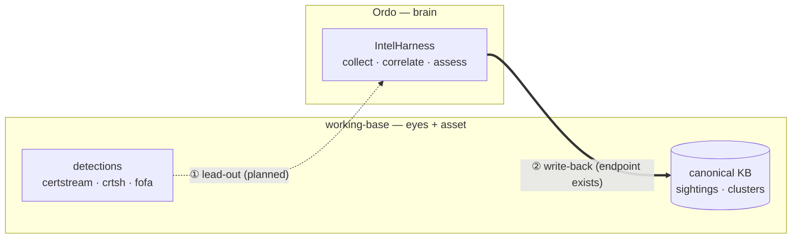

<div align="center">

# Ordo

**An OSINT investigation kit for Claude Code.**
Trace a scam operation from *one* website — or the app it pushes — to the **operator behind the whole cluster**.

`WebPivot` · `BinaryPivot` · `IntelAnalysis` · `IntelGraph` · `IntelReport` · `IntelHarness`

<sub>Claude Code skills · Python 3.8+ · shared, portable, case-data-free</sub>
<br><sub>repo: <code>intelligence_assist</code></sub>

</div>

---

## The one-minute mental model

You rarely care about a single domain — you care about **who runs the network** and the identifiers that expose them. This kit turns a seed into that answer:

1. **Collect** — pull the identifiers a page (or a downloaded app) can't easily rotate: favicon hash, analytics IDs, TLS cert, backend hosts, wallets, WHOIS, signing certs.
2. **Ingest** — every identifier becomes a **node** in a shared knowledge base; the host it came from links to it.
3. **Correlate** — domains that share nodes are the **same cluster**; the analyst layer attributes and scores confidence.
4. **Deliver** — a network graph and a report-ready PDF/DOCX.

The trick that makes it all fit together: **a website and the app it pushes emit the *same* JSON shape**, so one pipeline clusters them together automatically.


> [!IMPORTANT]
> **This is a shared tool — keep it clean.** The committed skills contain **only synthetic placeholders** (`site-a.example`, `com.example.app`, `CASE-0001`). Your real investigation data lives in `cases/` and `knowledge/`, which are **git-ignored and must never be committed.** See [OPSEC](#opsec--this-is-a-shared-tool).

---

## What's in the box

Six skills — three that **collect**, one that **thinks**, two that **publish** — over one shared knowledge base.

| Skill | Role | What it does |
|---|---|---|
| **WebPivot** | 🔎 Web collector | Pulls pivot artifacts from a page — favicon hash, tracking/analytics IDs, keyless-RDAP WHOIS, crypto wallets, TLS cert **+ JARM TLS-stack fingerprint**, CORS-trusted backend origins, SaaS/no-code operator tokens, Telegram, footer address — and emits ready-to-run pivot queries (Shodan, PublicWWW, crt.sh, urlscan…). Runs the full **Pivot Matrix** on every seed, flags app-download funnels, and hunts typosquat/lookalike domains. |
| **BinaryPivot** | 📦 File collector | Static IOC extraction from the binary a scam site serves (APK / `.exe` / `.dmg` / `.msi`): file hash, APK signing-cert, package, embedded backend/C2 hosts, Firebase tenant, wallets. Emits **WebPivot-shaped JSON** so the app clusters with the web infra. |
| **IntelAnalysis** | 🧠 Analyst | Correlates, attributes (same-kit / same-operator / same-actor), calibrates confidence, decides the next pivot. Reasons over the KB — it does **not** collect. |
| **IntelGraph** | 📈 Visualizer | Charts, timelines, and clustered interactive network graphs from the case data. |
| **IntelReport** | 📄 Publisher | Renders a finished assessment into a polished PDF + editable DOCX (editorial house style, Vietnamese-safe typography). |
| **IntelHarness** | 🎛️ Case runner | Drives the whole Collect → Correlate → Assess pipeline over one or many seeds, conversationally, from your Claude subscription. |

### One contract makes it chain

WebPivot **and** BinaryPivot emit the same pivot-JSON: a `meta` block, an `artifacts` block (every identifier found), and a ranked `pivots` array (copy-paste queries). Because a downloaded APK's backend host lands in the *same* field a website's backend host does, **one ingester, one correlation pass, and one cluster report cover a site and its app together.** A shared favicon hash, GA4 ID, wallet, or signing cert becomes the **same KB node** no matter which collector found it — so the app and the site converge on their own.

> [!NOTE]
> **The KB is a graph of *shared* artifacts.** Two domains pointing at the same `favicon:123456789` are a lead; two sharing that **and** `ga:G-XXXXXXXXXX` are a cluster. A single shared node is a lead, never proof — corroboration is a first-class rule.

---

## Quickstart

### 1. Install

<details>
<summary><b>Prerequisites & registering the skills</b> (click to expand)</summary>

**Prerequisites:** [Claude Code](https://claude.com/claude-code) (`claude --version`) and Python 3.8+. WebPivot's core needs nothing beyond the Python stdlib.

Claude Code discovers skills from `~/.claude/skills/`. Symlink each folder across (edit once, live everywhere):

```bash
# from the repo root
for s in WebPivot BinaryPivot IntelAnalysis IntelGraph IntelReport IntelHarness; do
  ln -s "$PWD/$s" ~/.claude/skills/$s
done
```

Restart Claude Code, then verify: `/WebPivot`, `/BinaryPivot`, `/IntelAnalysis`, `/IntelGraph`, `/IntelReport`, `/IntelHarness`. Confirm the shared tool surface with `/mcp` (server `intel`).

</details>

<details>
<summary><b>Optional dependencies</b> — install only what you use</summary>

```bash
# WebPivot — faster fetch + rendered post-JS DOM (needed for hosted-builder funnels / --render)
pip install requests playwright && playwright install chromium

# BinaryPivot — zero required deps (stdlib). Optional accelerators if present:
#   keytool (any JDK) → APK signing-cert SHA-256 (strongest same-operator pivot)
#   openssl → cert fallback · file/strings → typing + faster sweep · requests → nicer download

# IntelGraph — charts + entity graphs
pip install matplotlib graphviz          # graphviz also needs `dot`: brew install graphviz
npm i -g @mermaid-js/mermaid-cli         # only for Mermaid flows
# render_network.py (interactive graphs) is ZERO-dependency — JS libs are vendored.

# IntelReport — pandoc + a LaTeX engine (xelatex) for PDF; pandoc alone for DOCX.
```

</details>

> [!TIP]
> **API keys are optional.** Without them everything still works (extraction + query generation + **keyless-RDAP WHOIS** + passive Wayback/urlscan). WHOIS now runs on *every* domain with no key — keyless RDAP (rdap.org bootstrap) with a port-43 fallback for TLDs like `.vn`; `WHOISXML_API_KEY` only *enriches* it with registrant history. Keys unlock live pivoting. Read from the environment first, then a `chmod 600 ./.env` at the repo root: `URLSCAN_API_KEY`, `FOFA_KEY`, `FOFA_EMAIL`, `WHOISXML_API_KEY`, `PDNS_*`. Full keychain setup in `WebPivot/INSTALL.md`.

### 2. Run a case — three ways, same result

Pick by how you want to drive it. All three use the same tools and the same case files.

**(a) One command** — deterministic, no LLM, fully repeatable:

```bash
CASE=cases/mycase; mkdir -p "$CASE"
printf 'suspicious-site.example\nother-domain.example\n' > "$CASE/domains.txt"

python3 tools/intel.py open mycase "$CASE/domains.txt"                     # extract → ingest → cluster
python3 tools/intel.py open mycase "$CASE/domains.txt" --render --operator "name"  # + network graph
python3 tools/intel.py status mycase                                      # audit what persisted

# or drive it as a resumable convergence loop — collect → assess → chase the free frontier → repeat:
python3 tools/intel.py loop mycase "$CASE/domains.txt"                    # first run (free-only pivots → zero credits)
python3 tools/intel.py loop mycase                                        # resume exactly where it paused (state.json)
```

**(b) Conversationally, in Claude Code** — best for judgment and letting the agent choose the next pivot:

> *"Work case mycase from these seeds: site-a.example, site-b.example — collect, correlate, and tell me who the operator is."*

`IntelHarness` runs Collect → Correlate → Assess, archives evidence, never ends a cold seed on silence, and writes a **versioned, cited assessment**. Follow-ups that work: *"converge the case"*, *"cluster these 40 domains"*, *"render the network graph"*, *"make it a PDF"*.

**(c) Unattended / batch** — headless Agent-SDK driver (needs `ANTHROPIC_API_KEY`, pay-per-token):

```bash
source harness/.venv/bin/activate
export ANTHROPIC_API_KEY=...
python3 harness/orchestrator.py CASE-0001 --parallel --continue --depth 4 seed1.example seed2.example …
```

> [!NOTE]
> **Convergence is the stop condition, not a fixed depth.** A case is *done* when a collect/pivot round adds no new shared artifact to the cluster (`--continue` detects `CONVERGED` vs `EXPANDING`). `--parallel` scales to many domains by judging **clusters, not individual domains**.

> [!TIP]
> **The reasoning backend is swappable.** Set `HARNESS_BACKEND=openai|deepseek|kimi|local` and the SDK driver runs against any OpenAI-compatible `/chat/completions` endpoint (`harness/openai_backend.py` shim) — the orchestrator is untouched. Unset / `claude` uses the real Anthropic SDK. Useful for cost control or air-gapped runs.

---

## Under the hood

<details>
<summary><b>Why each artifact is a pivot</b></summary>

Every extracted artifact is chosen because it **survives re-skinning** — an operator changes a domain's name and logo in minutes, but the infrastructure and account-level identifiers underneath are expensive to rotate:

- **Favicon hash** — same icon across unrelated domains = shared kit/operator. Emitted per engine with the right algorithm (Shodan/FOFA = mmh3, Censys = md5, Netlas = sha256).
- **Analytics / operator tokens** — GA4 `G-`, `GTM-`, AdSense `pub-`, plus SaaS/no-code account IDs. An account ID ties every property the operator ever wired to it, even scrubbed ones.
- **Live TLS certificate** — SANs on a *different* registrable domain are a cross-brand operator link; the fingerprint finds every host serving that exact cert.
- **JARM TLS-stack fingerprint** — an *active* hash of the server's TLS stack (cipher/extension ordering), **not** the leaf cert. It survives a full domain **and** certificate rotation, so it re-finds an operator's origin on Shodan `ssl.jarm:` after they reissue everything. Suppressed under `--proxy` — it's a raw-socket probe.
- **CORS policy** — an active probe sends a foreign `Origin` and reads `Access-Control-Allow-Origin`. A literal allowed origin names a **backend host the app trusts that never appears in the page HTML**.
- **Redirect chains, wallets (incl. QR-hidden), Telegram, WHOIS registrant** — each an independent thread back to the operator.

WebPivot harvests **all** of these on every seed (the **Pivot Matrix**, `PivotMatrix.md`) rather than opportunistically — attribution is only as strong as your *strongest* shared artifact, so anchoring on WHOIS while a JARM or account-token link sits unread in the same DOM is the classic report weakness. It can also invert the seed: `--hunt-impersonation` sweeps typosquats, TLD permutations, and crt.sh keyword hits to surface lookalike domains **before** they're reported.

Every pivot carries a **confidence** (high/medium/low) reflecting how uniquely it identifies an operator.

</details>

<details>
<summary><b>Live vs passive, and OPSEC-aware collection</b></summary>

WebPivot fetches live by default but **always** also pulls the Wayback CDX timeline — a parked page today may have been a live scam funnel last year. Against hostile or Cloudflare-challenged targets it escalates (UA rotation → `--proxy` residential egress → `--render` a real browser → FlareSolverr), and failing that falls back to passive sources (Wayback snapshot, urlscan stored DOM) so a cold seed never ends on silence. Raw-socket probes (TLS) are suppressed when a proxy is set so they can't leak your real IP.

</details>

<details>
<summary><b>Cost accounting — two separate meters</b></summary>

- **Anthropic model cost** (the agent's reasoning) — captured per run by the SDK harness to `cases/<case>/run_cost.jsonl`. In interactive Claude Code, run `/cost`.
- **Third-party API credits** (FOFA / WhoisXML / urlscan / IPinfo / Shodan) — **not** in the model cost. Logged to `MEMORY/api_usage.jsonl` and summarized per run. When you report what a case cost, state the split.

</details>

### Where things live

```
cases/<case>/
  domains.txt          seed list                     raw/<host>.json    one pivot-JSON per host/binary
  shared.txt           cluster seeds (fast path)      dom/<host>.html    collected DOM
  SUMMARY.md           current assessment             assessments/<UTC>_*  immutable snapshots (audit)
  state.json           resumable-loop cursor          assessment.json    gaps / next_pivots / metered_leads
  run_cost.jsonl       per-run Anthropic model cost   evidence/manifest.jsonl + master_pivots.csv
knowledge/             the attributed KB (facts, entities, edges, reports/)
MEMORY/api_usage.jsonl third-party API credit ledger
```

Everything under `cases/` and `knowledge/` is git-ignored.

---

## Roadmap — hooking into working-base *(planned)*

Today Ordo is **self-contained**: seeds go in, assessments come out, and the KB lives in a local `knowledge/` folder. The next step is to connect it to **working-base** — 0xdefh's detection platform (certstream / crt.sh / FOFA collectors feeding a normalized sighting store and a detection-rule engine) — so the two form a closed loop.

The guiding idea: **the skills are the commodity; the KB is the moat.** The skills here are portable and case-data-free by design — anyone can copy them. The *accumulated investigation experience* (operator clusters, watchlist hashes, the attribution graph) is what can't be copied. So the design keeps that experience in working-base as the **appreciating asset**, and treats this agent as the **replaceable brain** that bolts onto it.



Two rails connect them:

| Rail | Direction | Status |
|---|---|---|
| **① Lead-out** | working-base detections → seed queue this agent drains | 🟡 planned |
| **② Write-back** | findings + learned attribution → back into working-base | 🟢 endpoint exists (`webpivot_ingest`) |

> [!NOTE]
> The two rails are **front-end agnostic** — built once, they work whether the agent runs in Claude Code (cheap, subscription) or headless via the SDK. Nothing below the roadmap depends on working-base; the integration is additive.

---

## OPSEC — this is a shared tool

> [!WARNING]
> **Never put real investigation data into the committed skills, tools, or docs** — no case names, target domains, operator/victim names, IPs, wallets, emails, API keys, tracker tokens, or signing-cert hashes, *including as a "worked example."* Partial redaction leaks structure; invent examples instead of anonymizing real ones.

**Use only generic placeholders:** `site-a.example`, `target.example`, `com.example.app`, `1.1.1.1`, `G-XXXXXXXXXX`, `CASE-0001`. The `.example` TLD is reserved and never resolves.

Your private data stays git-ignored (`cases/`, `knowledge/`, `knowledge_scratch/`, `MEMORY/`, `.env`) — never `git add -f` them. Before you push:

```bash
git ls-files cases/ knowledge/ knowledge_scratch/     # must print NOTHING
git diff --cached                                     # eyeball staged docs for real IOCs
git grep -nE '\b([0-9]{1,3}\.){3}[0-9]{1,3}\b|\b(bc1|0x[0-9a-f]{40})\b' -- WebPivot BinaryPivot IntelGraph IntelAnalysis IntelHarness
```

> [!CAUTION]
> **Authorized investigations only.** See `WebPivot/EthicalFramework.md`. Fetching a hostile site touches it directly — prefer passive sources (Wayback / urlscan) or non-attributable egress for adversarial targets. Pull binaries only from infra you're authorized to investigate; BinaryPivot is **static** extraction and never runs the sample.

---

## Adding a new tool or skill — register it once

Per the repo `CLAUDE.md` (RULE 2): wrap a new CLI tool as an `@tool(...)` in `harness/tools.py`. That single edit exposes it to the SDK `orchestrator.py`, the stdio `mcp_server.py` (auto-discovered), **and** interactive Claude Code (via `.mcp.json` → server `intel`). A new *mode* of an existing tool needs no new `@tool` — just extend that tool's description. Smoke-check:

```bash
WebPivot/.venv/bin/python3 harness/mcp_server.py   # send a tools/list JSON-RPC; the tool must appear
```

---

## Go deeper

| Doc | What it covers |
|---|---|
| **`PIPELINE.md`** | Step-by-step runbook for collect → correlate → visualize, a flags cheat-sheet, and a worked example. |
| **`harness/README.md`** | The Agent-SDK driver in depth — model cascade, cost levers, convergence, parallel cluster judgment, the egress guardrail. |
| **`WebPivot/INSTALL.md`** | Deeper WebPivot setup — API-key management (keychain, Linux/Windows), rendering, proxies. |
| **`WebPivot/SKILL.md`** + `references/` | The full pivot-artifact catalogue (incl. TLS, JARM, CORS/HTTP) and per-engine query syntax. |
| **`WebPivot/references/PivotMatrix.md`** | The "run every dimension on every seed" discipline — the artifact strength hierarchy (dispositive → corroborating) that ranks attribution. |
| **`IntelHarness/SKILL.md`** | The in-Claude case-runner playbook — phases, when to reject, when to stop. |
| each **`SKILL.md`** + `Workflows/` | Per-skill tradecraft and worked flows. |
